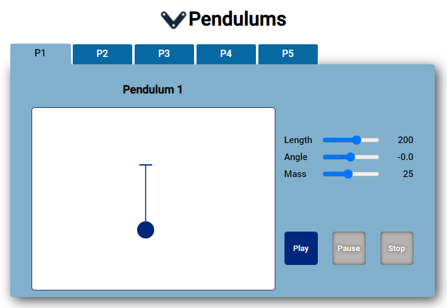

# Simple-Pendulum

This application models and displays a simple pendulum using node.js and vanilla JavaScript. There are 5 instances of pendulums each accessible through a separate tab. The pendulums can be modified with the range inputs and similated with the PLAY, PAUSE and STOP buttons.

STARTING THE SERVER:

- To begin, open the termal, cd into "server", then type "npm start", or "yarn start", to start the server. No database was used for this application, it is just a data file that is updated live, so there is not need for setting up a .env. Note: due to there being no real database connection, the information does not persist if the server batch job is terminated.

STARTING THE APPLICATION IN BROWSER (2 methods):

1. By the terminal \*\* :
   In another terminal (different from the one running the server), cd into "client" and type "npm start" or "yarn start".

   _\*\*note: the script in package.json is starting `http://127.0.0.1:5500/client`. If `http://127.0.0.1` is not your localhost IP, then try starting it the second method_

2. Open live server:
   From the explorer, right click the "index.html" file and click, "Open with Live Server"
 

